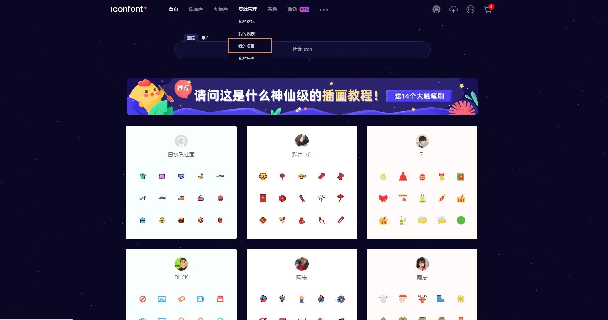
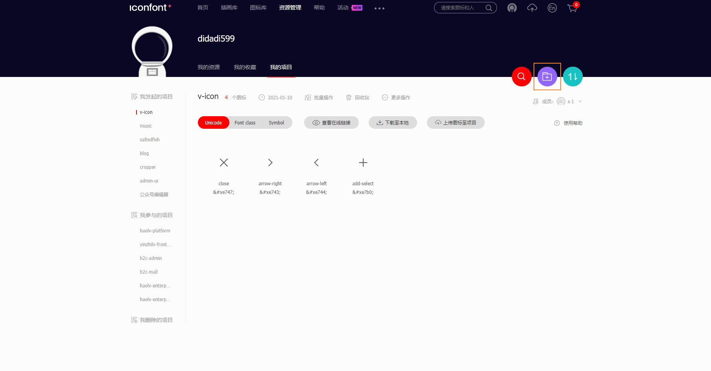
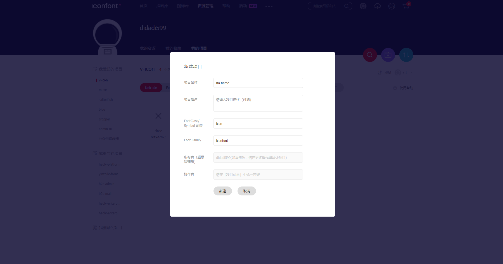
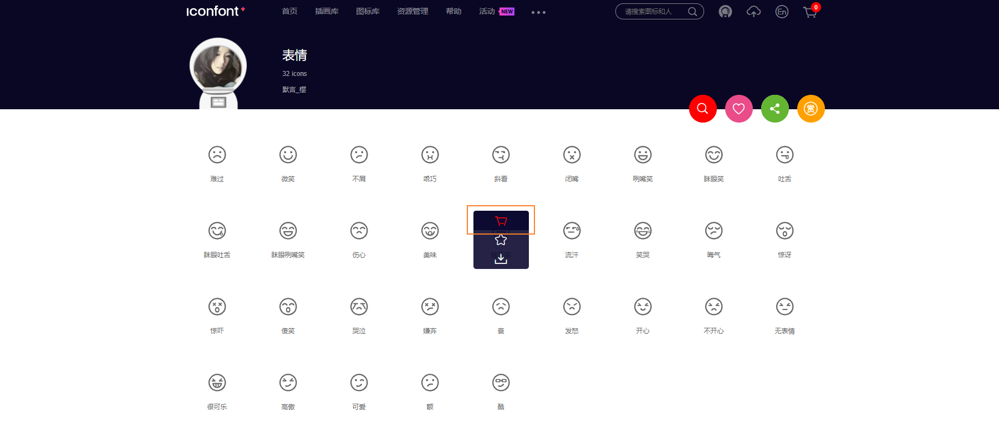
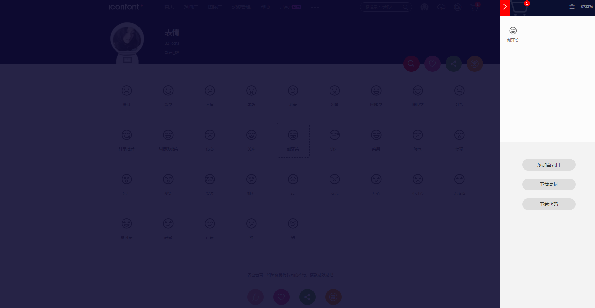
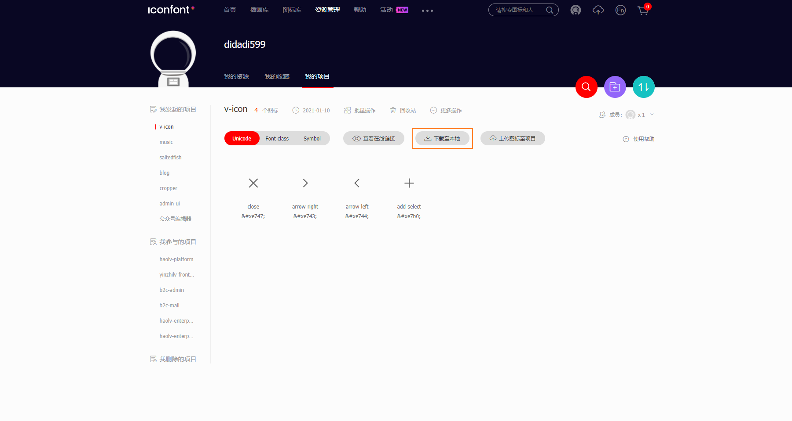
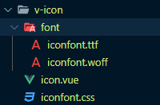

# Icon 图标

## 使用方法

直接通过设置类名为 `v-icon-iconName `来使用即可。例如：

:::demo
```html
<i class="v-icon-close"></i>
<i class="v-icon-arrow-left"></i>
<i class="v-icon-arrow-right"></i>

<v-icon name="add-select"></v-icon>
```
:::

## 组件实现

Icon 组件是对 iconfont 的 vue 封装实现。

### 注册 iconfont 账号

:::tip
注册地址：[https://www.iconfont.cn/](https://www.iconfont.cn/)
:::

### 新建 iconfont 项目

最顶部的菜单，点击 `资源管理 -> 我的项目`。



在右边找到橙色框框圈住的按钮，点击新建。



:::tip
项目名称：随便填

项目描述：想填就填

FontClass/Symbol 前缀：最好起一个有辨识度的 css 前缀，如 `v-icon-`

Font Family：这个用于 css 的 font-family，跟上面一样，起个有辨识度的
:::



### 给新建项目添加图标

搜一些你需要的图标，然后点那个小购物车图标，添加。



选的差不多之后，点击顶部最右边的那个购物车小图标，里面就是你选好的图标。



最后，点击添加项目，添加到你之前创建的项目就行了。

### 下载图标文件

回到刚刚创建的项目，点击下载到本地。



### 开始封装 Icon 组件

新建一个普通的组件目录结构。



在刚刚下载好的图标文件中，找到 `*.ttf`、`*.woff` 和 `*.css` 三个文件，按上图结构放好。

`*.css` 文件开头代码大概如下：

```css
@font-face {font-family: "iconfont";
  src: url('iconfont.eot?t=1610263854911'); /* IE9 */
  src: url('iconfont.eot?t=1610263854911#iefix') format('embedded-opentype'), /* IE6-IE8 */
  url('data:application/x-font-woff2;charset=utf-8;base64,d09GMgABAAAAAAL8AAsAAAAAByAAAAKtAAEAAAAAAAAAAAAAAAAAAAAAAAAAAAAAHEIGVgCDKgqBOIEzATYCJAMUCwwABCAFhG0HVxtGBhEVlHVkf4Q4xsZRpQqoBK3F2g4dlUvNoXqemvcEe/gaDHf9H4gKtIAqAAAAACAeojV+b3bn7u9H1JO4JtVEopkkKNlDJCRCk4pHEr0A1b0vAHoB8JJZNwO4WPTNqZ8rdAkRIJmw7f8w5Rt7PCdbOVld+YXmnOe6VzCRax1YDmw1yBARrB46gkVX/P05VBBmxOG0CRTIfMtymWPYxgDjzrtAxxoUWQkFwikMr12swzhOYIgZlomd7cGTmkTHBeLOcP2ilgtKKWWa0NcszYzXdFp56bwKvx+/l0ej6Co69ei1XVds/Y5mP+MTCBGwukPFMiRxqzZ5RRUSrRqya1qLpil8j6pZxbGZHRcPMQRl9B8viR4tHwa2IpV811W6SRF8KhCBQ/B98U8p78CQfHoe1vGCNAXBrhjW98Nun+63Tc/7lsdz8y2d3oKw+fMfYE//lOGGlSF1WAyvU9408DxZKMQE+Xn/x0ZDelDEK1Q08w1sdVzu4Y+o23ZvQXlnoDwK9XVp3S8CQf4/Izf+ayT4wocxjU81hd6iT9orx0PKEproEi3CUOxWCXSG9XQXvqDkU2YZ49s86vG9cwgNJCPcA6anqJp5xKQuQ2eoleg1WzDEUntWDzXWXVXkIJZ4ShBG+YhihE+oRvlMTOpXdCb4i96oqBjidIzdcqgFYRkMgVUEcj8aPK/RsaiJKi/oXrOVrCSkPyBpiFBdVMXMGStkjhnp3TWqkaLwQi05DfPMtAmP8Fr0qtuhLGPdmwrPS2YQWEUg96PB8xr9zmpKn7+ge81WWloa3A9IGvqnuqh6EM/KtVfLvbyS3l2jGikKL9SSQZhnpq1+0AivRT8ivh1K1i72VRbrq5dv3AVD0Ge7KFEjo4tel2dO2C/Cn1yGrleT2mdEgR5CnhDwmmUAAAA=') format('woff2'),
  url('iconfont.woff?t=1610263854911') format('woff'),
  url('iconfont.ttf?t=1610263854911') format('truetype'), /* chrome, firefox, opera, Safari, Android, iOS 4.2+ */
  url('iconfont.svg?t=1610263854911#iconfont') format('svg'); /* iOS 4.1- */
}

.iconfont {
  font-family: "iconfont" !important;
  font-size: 16px;
  font-style: normal;
  -webkit-font-smoothing: antialiased;
  -moz-osx-font-smoothing: grayscale;
}
```

修改 `*.css` 代码，如下：

:::tip
font-family：要跟项目的 font family 名字一致

src：两个 url 路径记得根据实际情况修改

旧的 `.iconfont` 选择器，改成 `[class*=" v-icon-"], [class^=v-icon-]` 选择器，`v-icon-` 为项目创建时的前缀，`[class*=" v-icon-"]` 选择器的 ` v-icon-` 最前面是有一个空格的。
:::

```css
@font-face {
  font-family : iconfont;
  src         : url(font/iconfont.woff) format("woff"), url(font/iconfont.ttf) format("truetype");
  font-weight : 400;
  font-display: "auto";
  font-style  : normal
}

[class*=" v-icon-"],
[class^=v-icon-] {
  font-family            : iconfont !important;
  speak                  : none;
  font-style             : normal;
  font-weight            : 400;
  font-variant           : normal;
  text-transform         : none;
  line-height            : 1;
  vertical-align         : baseline;
  display                : inline-block;
  -webkit-font-smoothing : antialiased;
  -moz-osx-font-smoothing: grayscale
}
```

到这里，只需要全局引用 `*.css` 文件，就可以通过 `i` 标签加 `class` 名字，就可以使用相应图标。

如果要使用 `v-icon` 这种，只需把 `icon.vue` 这个组件代码复制一份，跟上面的 `*.css` 一起使用就可以了。`icon.vue` 代码如下：

:::tip
注意把 `class` 前缀改成你项目的前缀。
:::

```vue
<template>
  <i :class="'v-icon-' + name"></i>
</template>

<script>
  export default {
    name: 'VIcon',

    props: {
      name: String
    }
  };
</script>
```

### 组件封装完成

一个简单的 `Icon` 组件就封装完成了。

<style scoped>
/deep/.v-icon-close,
/deep/.v-icon-arrow-left,
/deep/.v-icon-arrow-right,
/deep/.v-icon-add-select {
  font-size: 36px;
}
</style>